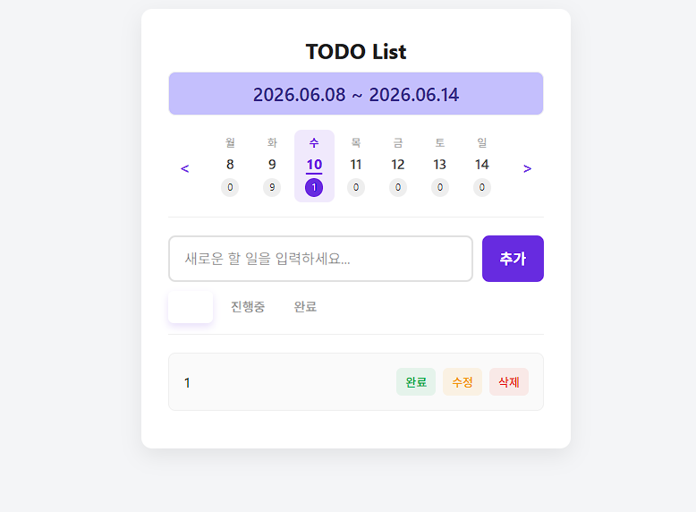

## 과제 목표
이번 과제를 통해 무엇을 배우고자 했는지 간단하게 작성해요.

- Vanilla JS로 작성된 앱을 React 컴포넌트 단위로 UI를 분리하고 props와 state의 역할 이해
- AI를 활용해 마이그레이션하고, 생성된 코드를 직접 읽고 수정
- Vanilla JS와 React 개발 방식의 차이 이해

---

## 과제 위치
- 브랜치명 : `week-02-강무진`
- 주요 파일 : `components/FilterSection.jsx` / `components/TodoInput.jsx` / `components/TodoList.jsx` /  `components/TodoItem.jsx` / `components/WeekNavigation.jsx`

---

## 구현한 기능
기본 미션 중 구현한 항목에 체크해요.

- [x] TODO CRUD 기능의 React Functional Component 마이그레이션 (개별 컴포넌트 분리 및 `useState` 활용)
- [x] TODO 수정 중 `isEditing` 등의 상태에 따른 UI 자동 변화 및 조건부 렌더링
- [x] 상태별 필터링 기능 (DOM 제어 방식에서 `filter` 상태 기반 렌더링으로 변경)
- [x] 로컬 스토리지 연동 (`useEffect`를 활용하여 `todos` 상태 변경 시 자동 저장되도록 통일)

---

## 도전 기능
도전 미션 구현을 시도했다면 구현 항목에 체크해요.

- [x] 주간 뷰 마이그레이션 (선택된 날짜 표시, 날짜별 필터링, 데이터 구조 최적화)

---

## AI 활용 내역
AI를 활용해 구현하거나 수정한 내용을 기록해요.
단순히 어떤 프롬프트를 썼는지보다, 어떤 결과를 받았고 어떻게 수정했는지를 중심으로 작성해요.

### 기존 Vanilla JS 앱을 React로 마이그레이션
- AI 활용 내용 :

저번 과제 피드백 중 한 튜터님이 Claude Code의 Plan Mode를 강조하셔서, Antigravity에서도 해당 기능이 제공되는 것을 확인하고
과제 1의 소스 코드와, 그 코드와 실행 흐름, 목표나 컴포넌트 분리 계획 등을 정리해서 todo-vanilla.md를 작성한 뒤 
Plan Mode를 통해 AI에게 todo-vanilla.md를 토대로 계획 문서를 작성하게 하고 검토하는 방식으로 전체 구현 계획을 한 문서에 정리했다.
이후, 그 문서를 토대로 한 번에 코드 작성을 요청한 뒤, 각 기능에 대해 수정사항을 새로운 대화로 분리한 후 여러 수정을 병렬적으로 진행했다. 

```
## project goal
./todo-vanilla 디렉토리의 소스코드들과 그 내용을 정리해놓은 todo-vanilla.md 파일을 이해하고 이 vanilla JS 코드를 기존 기능들을 유지한 채 React functional component 구조로 변환해.

## stacks
- React (v18+), Vite (v5.x), Tailwind CSS(v4.x), JavaScript
- Web Storage API (localStorage)

## 문서에 포함해야 할 내용
- React로 변환했을 때의 컴포넌트 계층 구조
- 관리할 데이터 모델
- 마이그레이션 중 발생할 잠재적 위험 요소

## 원칙
- plan mode와 코드 작성 시에 원칙을 준수해
- 변수명과 함수명은 역할을 알 수 있도록 명확하게 작성해
- 코드에는 동작 방식을 이해할 수 있도록 주석을 달아줘
- 기능을 추가하거나 수정할 때는 항상 수정하는 코드를 파일별로 나눠서 보여줘
- 답변을 바로 내놓기 전에, 해당 문제를 여러 단계로 나누어 신중하게 생각해
- 모든 작업을 마친 후에는 어떤 기능을 구현했는지 체크리스트로 답변해
- 요청하는 작업 **만** 수행하고 임의로 추가 작업을 할 때는 먼저 설명을 하고 내 확인을 받고 나서 진행해
```

기능별로 `Header`, `TodoInput`, `TodoList`, `TodoItem`, `FilterSection` 등의 컴포넌트로 분리하고 `useState`를 통해 상태를 관리하는 코드를 생성 받았다.

- 직접 수정한 부분 : 
    tailwindcss 관련해서 선택된 필터탭에 배경색이 정상적으로 적용되지 않는 에러가 있어 그 부분을 수정했다.
- 수정 이유 : 
    선택한 필터링 탭의 css가 잘 반영되지 않았다.

---

## 구현하면서 고민한 점
구현 과정에서 막혔던 부분이나 고민했던 내용, 해결 방법을 자유롭게 작성해요.

- 고민한 점 : 
    1. Vanilla JS에서는 `querySelectorAll`과 `display: none`을 사용해 상태 필터링을 직접 DOM 조작하는 로직으로 구현했지만, React에서는 이를 어떻게 효율적으로 처리할지 고민했다.
    2. 기존 결과물에서는 개별 TodoItem에 대해 `완료 / 수정 / 삭제` 버튼에 각각 이벤트 리스너를 붙였는데 이 방식은 TodoItem이 많아질수록 비효율적이므로 '이벤트 위임'이라는 상위 요소에 1개의 리스너를 달아서 그 내부에서 분기를 나누는 방식에 대해 고민했다.

- 해결 방법 : 
    1. 상태 관리를 통해 `App.jsx`에서 `filter` 상태를 정의하고, 렌더링 전에 자바스크립트 `Array.filter()`를 사용해 가공된 `todos` 배열만 하위 컴포넌트에 전달하는 Data-Driven 방식으로 전환하여 해결했다.
    2. 놀랍게도 React에서는 내부 엔진이 자동으로 Root 컴포넌트에서 이벤트 위임을 자동으로 처리해준다고 한다. 코드 상에는 버튼마다 onClick={}이 달려 있지만 실제로는 React가 Root에만 이벤트 리스너를 달고 알아서 계산하고 해당 이벤트 리스너를 불러준다고 한다. 이를 Synthetic Event System이라고 한다.

    ※Vanilla JS에서 이벤트 위임 로직 구현
    ```javascript
    todoListElement.addEventListener('click', (event) => {
        const target = event.target;

        const todoItem = target.closest('li');
        const todoId = todoItem.dataset.id; 
        const action = target.dataset.action;
        
        if (action === 'complete') {
            toggleTodoStatus(todoId);
        } else if (action === 'edit') {
            startEditing(todoId);
        } else if (action === 'delete') {
            deleteTodoItem(todoId);
        }
    });
    ```

---

## 과제 회고
과제를 마치고 느낀 점, 아쉬운 점, 다음에 개선하고 싶은 점을 자유롭게 작성해요.

- 잘한 점 : `useState`와 `useEffect`를 활용해 상태와 렌더링의 흐름을 이해했고 AI를 활용할 때 한 대화에서 하나의 주제만을 다루니까 Hallucination이 거의 발생하지 않았다.
- 아쉬운 점 : 컴포넌트 간 상태 공유가 많아져서 관리가 복잡해지는 느낌을 받았고 Object literal까지 써서 데이터 검증 로직이나 복잡한 if-else를 대체하려고 하니 적용이 잘 안된다.
- 다음에 시도해볼 것 : `useState`나 `useEffect` 등의 훅을 계속 다루다 보니 감이 잡히는 느낌이다. 커스텀 훅도 직접 작성해서 구현해봐야겠다.

---

### 트러블 슈팅


- 선택한 필터링 탭의 css가 잘 반영되지 않았다.
``` 기존 :
className={`border-none text-sm font-medium cursor-pointer px-3 py-2 rounded-md transition-all ${
                            isActive 
                            ? 'text-white bg-primary shadow-[0_4px_8px_rgba(103,43,224,0.15)]' 
                            : 'text-[#a0a0a0] bg-transparent hover:bg-[#f0f0f0]'
                        }`}
```

``` 수정후 :
className={`border-none text-sm font-medium cursor-pointer px-3 py-2 rounded-md transition-all ${
                            isActive 
                            ? 'text-white bg-primary shadow-[0_4px_8px_rgba(103,43,224,0.15)]' 
                            : 'text-[#a0a0a0] bg-transparent hover:bg-[#f0f0f0]'
                        }`}
```                        
- 기존에는 className에 고정으로 `bg-transparent`가 포함되어 있어 `bg-primary`와 중복되었을 때 항상 `bg-transparent`가 우선시되었다. 
- isActive 조건식 의 false 경우에 `bg-transparent`를 포함시켜 `bg-primary`가 덮이는 것을 수정했다.


---

# 제출 전 최종 체크리스트
최종 제출 전에, 다음 체크리스트를 활용하여 빠진 것은 없는지 확인해봅시다.

### 기능 구현
- [x] 필수 기능이 모두 구현되어 있다
- [x] Issue 템플릿에 맞추어 진행한 과제 내용을 작성했다
- [x] 예외 상황에서도 오류 없이 동작한다 (ex. 빈 입력값 제출, 데이터 없는 상태 등)
- [x] 새로고침 후에도 데이터가 유지되거나 의도한 대로 초기화된다

### 코드 품질
- [x] 불필요한 `console.log`, 주석 처리된 사용하지 않는 코드가 제거되어 있다
- [x] 변수명과 함수명이 역할을 명확히 나타낸다
- [x] 중복 코드가 없고, 반복되는 로직은 함수로 분리되어 있다
- [x] 들여쓰기와 코드 포맷이 일관되게 유지되어 있다

### UI/UX
- [x] 모든 기능이 UI 상에서 명확하게 인지 가능하다
- [x] 빈 상태(데이터 없음)에 대한 화면 처리가 되어 있다

### 브라우저 검증
- [x] 크롬 기준 콘솔에 에러가 없다
- [x] 주요 기능을 직접 클릭하며 E2E 흐름을 확인했다

### 프로젝트 구조
- [x] 파일과 폴더 구조가 정리되어 있다
- [x] 불필요한 파일이 포함되어 있지 않다 (ex. node_modules, .DS_Store 등)