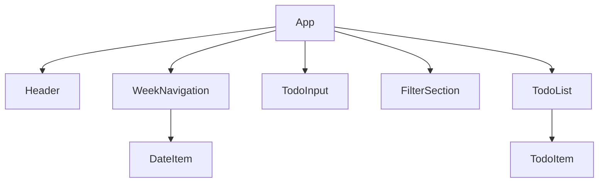

# Vanilla JS TODO App to React Migration Plan

본 계획서는 `todo-vanilla` 디렉토리에 위치한 기존 Vanilla JS TODO 앱을 React(v18+), Vite(v5.x), Tailwind CSS(v4.x) 환경으로 마이그레이션하기 위한 세부 계획을 담고 있습니다.

## User Review Required

> [!IMPORTANT]
> **Tailwind CSS 설치 확인**
> 현재 프로젝트(`todo-react`)의 `package.json`을 확인해 본 결과 Tailwind CSS가 설치되어 있지 않습니다. 본격적인 코드 작성 전에 Tailwind CSS v4.x를 설치하고 세팅하는 과정이 포함될 예정입니다.

> [!WARNING]
> **데이터 모델의 고유 ID(Key) 추가**
> 기존 Vanilla JS에서는 배열 요소에 고유 `id`가 없었습니다. 하지만 React에서는 리스트 렌더링 시 고유한 `key`가 필요합니다. 기존 localStorage 데이터를 유지하면서 고유 ID를 부여하는 하위 호환성 코드를 마이그레이션 시 추가하겠습니다.

## 1. 컴포넌트 계층 구조 (Component Hierarchy)

전체 애플리케이션을 단일 컴포넌트(`App`)에서 관리하기보다, 기능 단위로 분리하여 다음과 같은 트리 구조로 구성합니다.



- **`App`**: 전체 상태(Todos, SelectedDate, Filter 등)를 관리하고 하위 컴포넌트로 props를 전달하는 최상위 컴포넌트
- **`Header`**: 앱 타이틀 및 선택된 주간 범위 라벨 표시
- **`WeekNavigation`**: 이전/다음 주 이동 버튼 및 해당 주의 요일/날짜 리스트 표시
  - **`DateItem`**: 개별 날짜 렌더링, Today 표시, 선택 상태 표시 및 날짜별 TODO 개수 배지 표시
- **`TodoInput`**: 새로운 TODO를 입력하고 추가하는 폼 (에러 메시지 표시 기능 포함)
- **`FilterSection`**: 전체 / 진행중 / 완료 상태 탭 버튼
- **`TodoList`**: 필터링 및 날짜 선택이 적용된 TODO 목록 렌더링
  - **`TodoItem`**: 개별 TODO의 텍스트, 완료 상태, 수정 및 삭제 로직(인라인 에러 검증 포함) 처리

## 2. 관리할 데이터 모델 (Data Model)

React의 상태(`useState`)로 관리해야 할 주요 데이터는 다음과 같습니다.

### 2.1 Todos 상태 (`todos`)
기존 구조에 `id` 필드를 추가하여 React 렌더링 최적화를 도모합니다.

```typescript
type Todo = {
  id: string;        // React의 key로 사용할 고유 ID (예: Date.now().toString())
  text: string;      // 할 일 내용
  date: string;      // 저장된 날짜 (예: "Mon Jun 09 2026")
  completed: boolean;// 완료 여부
};

// State: const [todos, setTodos] = useState<Todo[]>([]);
```

### 2.2 기타 UI 상태
- `selectedDate` (`Date`): 사용자가 클릭하여 선택한 날짜 (기본값: 오늘)
- `currentWeekStart` (`Date`): 주간 뷰에서 기준이 되는 해당 주의 월요일 날짜
- `filter` (`'all' | 'active' | 'completed'`): 현재 선택된 상태 필터

## 3. 마이그레이션 중 발생할 잠재적 위험 요소

> [!WARNING]
> **상태 동기화 타이밍 (State Syncing with LocalStorage)**
> Vanilla JS에서는 이벤트가 발생할 때마다 DOM을 변경하고 `saveTodos()`를 직접 호출했습니다. React에서는 `useEffect`를 활용하여 `todos` 상태가 변경될 때만 localStorage에 저장하도록 구현해야 상태와 스토리지 간의 데이터 불일치 버그를 예방할 수 있습니다.

> [!CAUTION]
> **날짜(Date) 객체 처리 문제**
> 자정(00:00:00) 기준으로 시간을 초기화하여 비교하는 로직이 React의 상태 업데이트 사이클과 맞물려 참조(Reference)가 달라질 수 있습니다. 객체 참조 비교 대신 `toDateString()`과 같은 문자열 기반 비교를 사용하여 의도치 않은 재렌더링 및 필터링 오류를 방지해야 합니다.

> [!NOTE]
> **Tailwind CSS v4 마이그레이션**
> 기존 `style.css`의 모든 스타일을 Tailwind CSS 유틸리티 클래스로 변환해야 합니다. 기존의 동적 클래스 토글 로직(`active`, `hidden`, `completed` 등)은 React의 조건부 렌더링(Conditional Rendering)이나 템플릿 리터럴 문법(`` className={`${condition ? 'classA' : 'classB'}`} ``)으로 교체해야 합니다.

## Proposed Changes

1. **프로젝트 환경 설정**
   - Tailwind CSS v4.x 및 관련 플러그인 설치
   - `vite.config.js` 및 CSS 설정 파일 업데이트
2. **React 컴포넌트 구현**
   - `src/components/` 디렉토리를 생성하고 위의 계층 구조에 맞게 파일을 분리하여 구현
   - `src/App.jsx` 에 중앙 상태 관리 로직 작성
3. **스타일 마이그레이션**
   - `todo-vanilla/style.css`를 분석하여 Tailwind 유틸리티 클래스로 매핑
4. **LocalStorage 연동 및 구 데이터 호환성 처리**
   - 앱 로드 시 `id`가 없는 구형 데이터를 발견하면 자동으로 `id`를 부여하도록 보정 로직 추가

## Verification Plan

### 수동 검증 포인트
- [ ] 입력창에 빈 텍스트 입력 시 하단에 에러 메시지가 표시되는가?
- [ ] 날짜 클릭 시 해당 날짜의 TODO만 필터링되어 나타나는가?
- [ ] 진행중/완료 탭 이동 시 CSS 'hidden'이 아닌 React 조건부 렌더링으로 목록이 변경되는가?
- [ ] 수정 모드 진입 후 빈 텍스트 저장 시도시 에러 메시지가 표시되는가?
- [ ] 수정 시 다른 모든 버튼(완료, 다른 항목의 수정/삭제 등)이 비활성화되거나 UI 처리가 적절히 되는가?
- [ ] 페이지 새로고침 시 변경된 상태와 데이터가 LocalStorage에서 완벽히 복원되는가?
